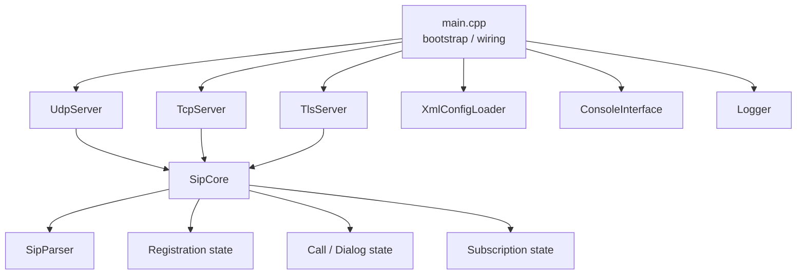

# 그림 초안

이 문서는 본문에 표시한 그림 삽입 위치에 대응하는 실제 초안 모음이다. 우선은 편집과 검토가 쉬운 ASCII/Mermaid 중심으로 작성한다.

## Figure 1. SIPLite 전체 아키텍처 지도

권장 배치:

- [01_project_overview.md](/home/windmorning/projects/SIPWorks/SIPLite/docs/book/01_project_overview.md)

### ASCII 초안

```text
                         +----------------------+
                         |      main.cpp        |
                         | bootstrap / wiring   |
                         +----------+-----------+
                                    |
        +---------------------------+---------------------------+
        |                           |                           |
        v                           v                           v
+---------------+         +----------------+         +----------------+
|   UdpServer   |         |   TcpServer    |         |   TlsServer    |
| recv/send     |         | recv/send      |         | recv/send+SSL  |
+-------+-------+         +--------+-------+         +--------+-------+
        \                          |                          /
         \                         |                         /
          \                        |                        /
           +-----------------------+-----------------------+
                                   |
                                   v
                        +------------------------+
                        |        SipCore         |
                        | routing / state / SIP  |
                        +-----+-----+-----+------+
                              |     |     |
                              |     |     |
                              v     v     v
                    +-----------+ +------+ +--------------+
                    | Registrar | | Call | | Subscription |
                    | state     | | state| | state        |
                    +-----------+ +------+ +--------------+
                              |
                              v
                        +-------------+
                        | SipParser   |
                        | raw -> SIP  |
                        +-------------+

   +--------------------+     +-------------------+     +----------------+
   | XmlConfigLoader    |     | ConsoleInterface  |     | Logger         |
   | static terminals   |     | ops / inspection  |     | logs / rotate  |
   +--------------------+     +-------------------+     +----------------+
```

### Mermaid 초안



## Figure 2. `main.cpp` 런타임 초기화 순서도

권장 배치:

- [02_entrypoint_and_runtime.md](/home/windmorning/projects/SIPWorks/SIPLite/docs/book/02_entrypoint_and_runtime.md)

```text
main()
  |
  +--> signal handler 등록
  |
  +--> config path 결정
  |
  +--> Logger init
  |
  +--> UdpServer 생성/시작
  |
  +--> XML load
  |
  +--> TcpServer 시작
  |
  +--> [if TLS enabled]
  |      +--> cert/key 확인
  |      +--> TlsServer 시작
  |      +--> SipCore TLS local address 등록
  |
  +--> SipCore::setSender(...)
  |
  +--> XML terminal bootstrap 등록
  |
  +--> ConsoleInterface 시작
  |
  +--> main cleanup loop
  |      +--> cleanupTimerC
  |      +--> cleanupExpiredRegistrations
  |      +--> cleanupExpiredSubscriptions
  |      +--> cleanupStaleCalls
  |      +--> cleanupStaleTransactions
  |
  +--> shutdown
         +--> console.stop
         +--> tls.stop
         +--> tcp.stop
         +--> udp.stop
         +--> logger.shutdown
```

## Figure 3. TLS transport에서 SipCore로 이어지는 처리 경로

권장 배치:

- [03_transport_layers.md](/home/windmorning/projects/SIPWorks/SIPLite/docs/book/03_transport_layers.md)
- [05_tls_implementation.md](/home/windmorning/projects/SIPWorks/SIPLite/docs/book/05_tls_implementation.md)

```text
TCP accept/connect
      |
      v
 SSL_accept / SSL_connect
      |
      v
   SSL_read
      |
      v
  recvBuffer 누적
      |
      v
 extractSipMessage()
      |
      v
 UdpPacket {
   remoteIp,
   remotePort,
   data,
   transport = TLS
 }
      |
      v
 worker queue route(Call-ID)
      |
      v
 SipCore::handlePacket()
      |
      v
 sender callback -> TlsServer::sendTo()
      |
      v
   SSL_write
```

## Figure 4. REGISTER 처리 흐름도

권장 배치:

- [09_register_flow.md](/home/windmorning/projects/SIPWorks/SIPLite/docs/book/09_register_flow.md)

```text
REGISTER 수신
   |
   +--> To / Contact 확인 실패? ---- yes ---> 400 Bad Request
   |
   no
   |
   +--> AoR 추출
   |
   +--> XML 사전 등록 단말 확인 실패?
   |         |
   |         +--> unknown user -------> 404 Not Found
   |         +--> not allowed --------> 403 Forbidden
   |
   +--> authPassword 존재?
   |         |
   |         +--> yes --> Authorization 검사
   |                     |
   |                     +--> 실패 ------> 401 Unauthorized
   |
   +--> Expires 파싱 실패? ---- yes ---> 400 Bad Request
   |
   +--> Expires == 0 ?
   |         |
   |         +--> yes --> deregistration 처리 --> 200 OK
   |
   +--> Registration 갱신
   |         - contact
   |         - source ip/port
   |         - transport
   |         - loggedIn=true
   |
   +--> 200 OK
```

## Figure 5. INVITE와 `PendingInvite` 수명주기

권장 배치:

- [10_invite_call_flow.md](/home/windmorning/projects/SIPWorks/SIPLite/docs/book/10_invite_call_flow.md)

```text
INVITE 수신
  |
  +--> registration lookup
  |      +--> not found   -> 404
  |      +--> offline     -> 480
  |
  +--> retransmission check
  |      +--> existing -> cached response / 100 Trying
  |
  +--> caller에게 100 Trying
  |
  +--> Via / Record-Route / Max-Forwards 조정
  |
  +--> Request-URI -> callee Contact
  |
  +--> ActiveCall 생성 (confirmed = false)
  |
  +--> PendingInvite 생성
  |      - timerCExpiry
  |      - caller/callee transport
  |      - lastResponse
  |
  +--> callee로 INVITE 전달
  |
  +--> provisional response
  |      +--> Timer C 연장
  |
  +--> final 2xx
  |      +--> Dialog 생성
  |
  +--> ACK
  |      +--> confirmed = true
  |      +--> PendingInvite 제거
  |
  +--> 또는 Timer C timeout / CANCEL / error response
         +--> cleanup / ACK / CANCEL / state remove
```

## Figure 6. SUBSCRIBE / NOTIFY 수명주기

권장 배치:

- [12_subscribe_notify.md](/home/windmorning/projects/SIPWorks/SIPLite/docs/book/12_subscribe_notify.md)

```text
SUBSCRIBE 수신
   |
   +--> Event / Contact / Expires 확인
   |
   +--> Subscription 저장 또는 갱신
   |
   +--> 200 OK
   |
   +--> initial NOTIFY 생성/전송
   |
   +--> 주기 중 refresh SUBSCRIBE
   |      +--> expires 갱신
   |
   +--> unsubscribe (Expires: 0)
   |      +--> terminated NOTIFY
   |      +--> subscription 제거
   |
   +--> cleanupExpiredSubscriptions()
          +--> 만료 감지
          +--> terminated NOTIFY
          +--> 제거
```

## Figure 7. 운영 관점 전체 지도

권장 배치:

- [28_operations_checklist.md](/home/windmorning/projects/SIPWorks/SIPLite/docs/book/28_operations_checklist.md)

```text
Config -> Build -> Start -> Register/Call Traffic -> Logging -> Cleanup -> Shutdown
   |        |        |             |                  |          |          |
   |        |        |             |                  |          |          |
XML     Makefile   main.cpp     SipCore         Logger.cpp   cleanup*   stop()
ENV      tests     transport    REGISTER/INVITE  log files   timers     flush
```
